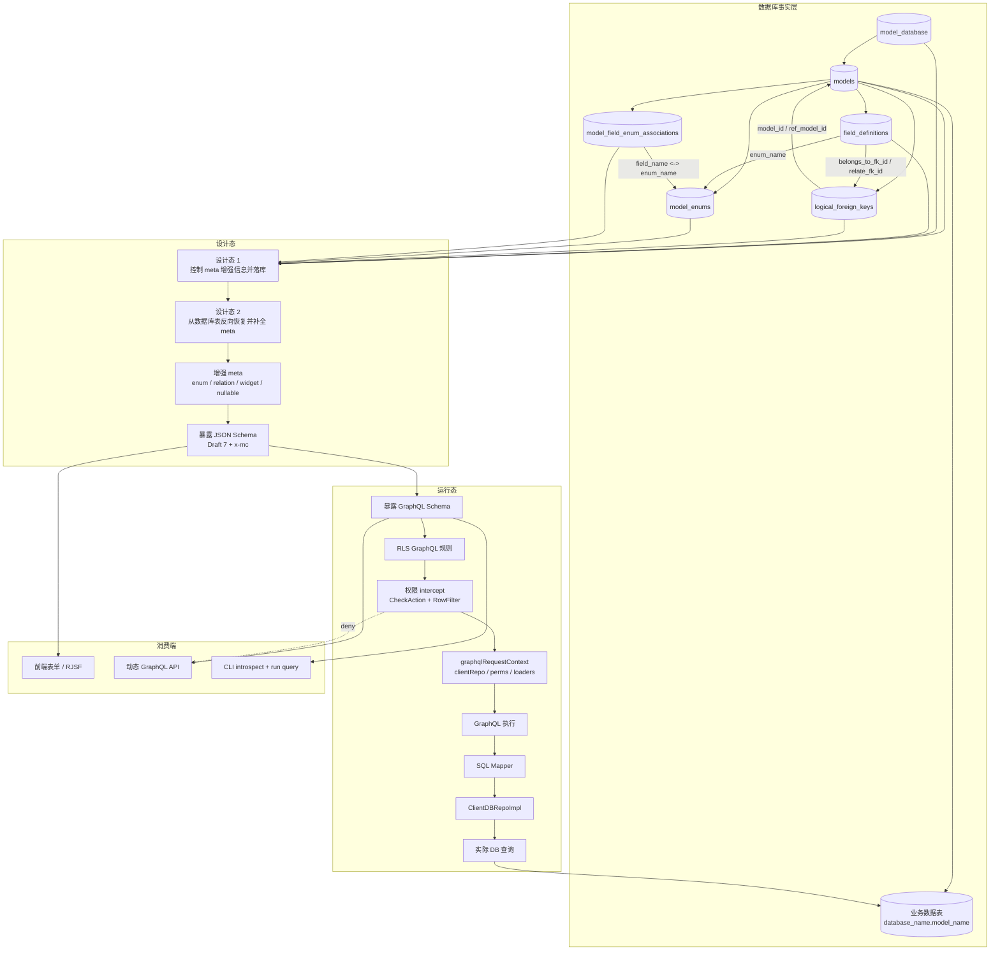

```mermaid
flowchart TB
  subgraph Source[数据库事实层]
    D0[(model_database)]
    D1[(models)]
    D2[(field_definitions)]
    D3[(logical_foreign_keys)]
    D4[(model_enums)]
    D5[(model_field_enum_associations)]
    D6[(业务数据表<br/>database_name.model_name)]
  end

  subgraph Design[设计态]
    direction TB
    M0[设计态 1<br/>控制 meta 增强信息并落库]
    M1[设计态 2<br/>从数据库表反向恢复并补全 meta]
    M2[增强 meta<br/>enum / relation / widget / nullable]
    M3[暴露 JSON Schema<br/>Draft 7 + x-mc]
  end

  subgraph Runtime[运行态]
    direction TB
    R0[暴露 GraphQL Schema]
    R1[RLS GraphQL 规则]
    R2[权限 intercept<br/>CheckAction + RowFilter]
    R3[graphqlRequestContext<br/>clientRepo / perms / loaders]
    R4[GraphQL 执行]
    R5[SQL Mapper]
    R6[ClientDBRepoImpl]
    R7[实际 DB 查询]
  end

  subgraph Consumer[消费端]
    direction TB
    C0[前端表单 / RJSF]
    C1[动态 GraphQL API]
    C2[CLI introspect + run query]
  end

  D0 --> D1
  D1 --> D2
  D1 --> D3
  D1 --> D4
  D1 --> D5
  D1 --> D6

  D2 -->|belongs_to_fk_id / relate_fk_id| D3
  D2 -->|enum_name| D4
  D3 -->|model_id / ref_model_id| D1
  D5 -->|field_name <-> enum_name| D4

  D1 --> M0
  D0 --> M0
  D2 --> M0
  D3 --> M0
  D4 --> M0
  D5 --> M0
  M0 --> M1 --> M2 --> M3

  M3 --> C0
  M3 --> R0
  R0 --> C1
  R0 --> C2
  R0 --> R1
  R1 --> R2
  R2 --> R3
  R3 --> R4
  R4 --> R5 --> R6 --> R7
  R7 --> D6
  R2 -. deny .-> C1
```
